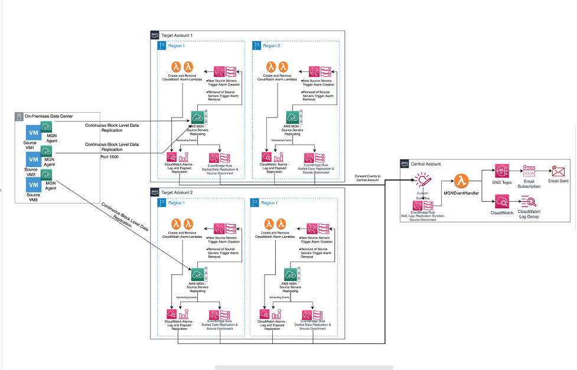
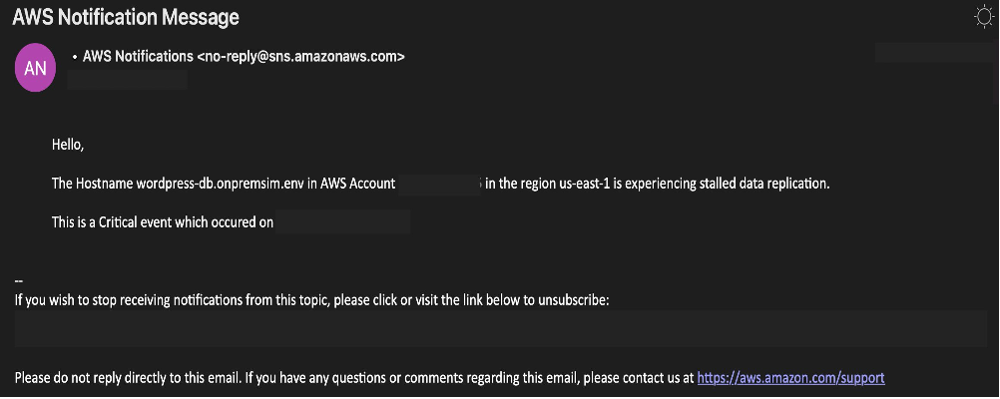
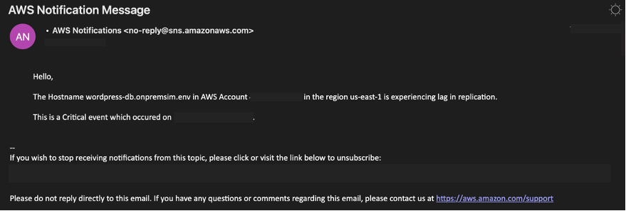
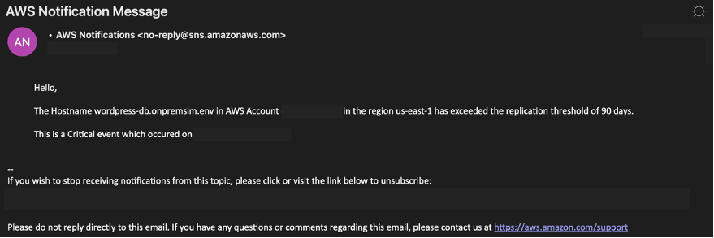
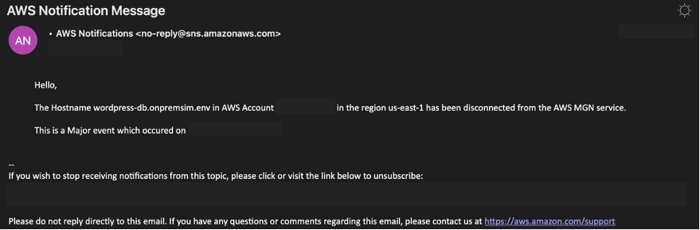

# AWS Application Migration Service Monitoring with Amazon EventBridge, Amazon CloudWatch, and AWS Lambda

## Introduction

Customers commonly begin their journey to AWS by rehosting (lifting-and-shifting) servers in their on-premises environment. They do this for various business reasons, including shifting from capital to operational expense, reducing total cost of ownership, reducing support costs, data center exit, and many others. AWS Application Migration Service (MGN) is the automated lift-and-shift service that facilitates server migrations to AWS at scale. The AWS MGN service enables organizations to move applications to AWS with minimal downtime and without changing the applications or their architecture. Using AWS MGN, customers can migrate servers with very minimal downtime and without requiring any changes on the application side.

Scaling migration operations to meet business needs requires many components, including observability. Commonly, servers are grouped by dependencies and migrated as a unit. In order for the unit to successfully migrate, all data must be fully replicated on migration day. The AWS MGN agent is installed on source servers and subsequently replicates data to the AWS account and region. As a result of environment, network, or data changes, replication can stall or lag, jeopardizing the migration. Additionally, source servers incorrectly disconnected from MGN require re-replication of data, possibility causing a migration delay. Without visibility into these events, the customers migration timelines and cadence are at risk of delay. Migration delays result in additional costs and rework requiring more person hours. Monitoring for replication stall, lag, or source server disconnect events in a timely manner can help mitigate these risks. 

This solutions demonstrates how customers can monitor AWS MGN operations across multiple accounts and regions where they migrate servers into from their on-premise environments.

**Contents:**
* [Solution Overview](#solution-overview)
* [Prerequisites](#prerequisites)
* [Solution Deployment Steps](#solution-deployment-steps)
* [Testing the Solution](#testing-the-solution)
* [Clean Up](#clean-up)
* [Conclusion](#conclusion)

## Solution Overview

This solution uses a central and target AWS account concept. Target AWS account is the one where your source server from on-premise will be migrated to and Central AWS account is  the one where AWS MGN events and CloudWatch alarms from various target AWS accounts will be forwarded to for processing and aggregation. Here’s a further explanation on what activity occurs in each of the accounts along with the architecture of the proposed Solution:

### Figure 1: Solution Architecture

                                

### Target Account

Target account monitoring resources include Amazon CloudWatch Alarms, AWS Lambda Function, Amazon EventBridge Rules, and AWS Identity and Access Management roles. When this solution is deployed, it creates a Lambda function in the Target account which automatically creates new alarms for lag duration and elapsed data replication whenever new source servers are onboarded into AWS MGN. Subsequently, when source servers are removed from AWS MGN, an additional Lambda function automatically removes the alarms that were configured for that source server. An EventBridge rule is configured by this solution that forwards events to the Central Account’s EventBus when the CloudWatch Alarms transitions to an ‘ALARM’ state. 

AWS MGN natively sends certain MGN events to AWS EventBridge, including when data replication becomes stalled. An EventBridge rule is configured to forward events to the Central Account EventBus when source servers in MGN experience stalled data replication. You can monitor single or multiple Target Accounts using this solution by following through the implementation steps described through the rest of the blog, for the sake of simplicity will be using a single target account for walkthrough in this blog.

### Central Account

The Central monitoring account resources include a custom EventBus, EventBridge Rule, Lambda Function, Amazon Simple Notification Service Topic and Subscription, and CloudWatch LogGroup. 

An EventBridge Rule is configured in the Central account to execute a Lambda function (we will refer to this function as Central Account Lambda) whenever events are pushed to the Central account EventBus. The Lambda function processes the events to a common schema, then pushes the formatted event to an SNS Topic and to a CloudWatch LogGroup.

## Prerequisites

In this post, we assume that you have configured AWS Application Migration Service and are ready to install the replication agent on source servers intended for migration to AWS. We also assume that you have a central AWS account where events will be aggregated. 

Before following the solution deployment steps, ensure you have the following:
1.	Two AWS accounts with permissions to deploy and manage the services described in this post in those accounts
2.	An S3 Bucket to store the packaged CloudFormation template for solution deployment

## Solution Deployment Steps

The solution includes two CloudFormation Templates one that is deployed in Target Account to collect MGN events and alerts and the other that is deployed in Central Account to process the aggregated events and send to an SNS topic for email-based alerts.  These CloudFormation templates are located in folders `central_account/` and `target_account/` in the solution repository. The solution also includes sample code for Lambda function that processes the aggregated events in Central account. The Central account Lambda function is located in lambda_function/. 

Below are the steps for Implementing this Solution
1.	Package the Central Account Lambda Code
2.	Deploy the Solution
    1.	Into your Central Account
    2.	Into your Target Account
1.	 Package the Central Account Lambda Code

In this solution, we provide you with sample Lambda code that processes events from CloudWatch Alarms and MGN from multiple accounts. You can clone the GitHub repository and customize the Lambda code to meet your needs. The Central Lambda function is written in Python and is too large to be included inline in the CloudFormation template, therefore it must be packaged. To automate packaging of the Lambda function, we provide a CloudFormation template that sets up a Cloud9 Environment. Follow the steps below to deploy the Cloud9 CloudFormation template that will package the Lambda code and generate an output CloudFormation template that can further be used for deploying the solution.

1.	[Download this CloudFormation template and save it locally](https://github.com/aws-samples/aws-application-migration-service-monitoring/blob/main/cloud9/cloud9-mgn-monitoring.yaml). 
2.	In your Central account, navigate to the AWS CloudFormation console
3.	Choose Create Stack, and then choose `With new resources (standard)`.
4.	On the Create Stack page, under Specify template you downloaded in Step a) then choose Upload a template file.
5.	Select Choose file, and then choose the cloud9-mgn-monitoring.yaml template file from your local folder
6.	On the Specify Stack Details page, enter a name for your stack (for example, MGNMonitoringCloud9Stack).
7.	Under Parameters, enter these values for the following parameters:
    1.	**S3BucketName**: Name of the S3 bucket where packaged CloudFormation template will be uploaded.
    2.	**MGNCodeZipUrl**: [URL for the MGN Code zip file](https://github.com/aws-samples/aws-application-migration-service-monitoring/archive/refs/heads/main.zip).

After the stack successfully deploys, navigate to the S3 console, click on the S3 bucket that you specified in step #7 above and download central_account_monitoring_resources_packaged.yaml file. Then proceed to step #2. 

### Deploy the Solution

#### Into your Central Account

After packaging the Central account Lambda code and verifying it exists in the S3 Bucket you specified, create a CloudFormation stack in the Central AWS Account by using the newly generated CloudFormation template central_account_monitoring_resources_packaged.yaml. The Central Account resources must be deployed first, as the Target Account CloudFormation stack takes outputs from the Central Stack as input. 

1.	Sign in to the Central account and open the AWS CloudFormation console.
2.	Confirm that your console session is in the same AWS Region as the S3 bucket in which you packaged the Lambda code.
3.	Choose Create Stack, and then choose `With new resources (standard)`.
4.	On the Create Stack page, under Specify template, choose Upload a template file.
5.	Select Choose file, and then choose the central_account_monitoring_resources_packaged.yaml template file in your local folder (central_account/).
6.	Choose Next.
7.	On the Specify Stack Details page, enter a name for your stack (for example, MGNMonitoringCentralAccountStack).
8.	Under Parameters, enter these values for the following parameters:
    1.	**EventBusPolicyPrincipal**: A comma separated list of AWS account IDs which will send MGN events to the Central Account.
    2.	**MGNMonitoringLambdaRoleName**: The name for the role assumed by the Central MGN event processing Lambda function. 
    3.	**SNSSubscriptionEmail**: The email to send MGN data stall, lag, elapsed data replication, and source server disconnect alerts to.
9.	On the Configure stack options page, you can add tags or choose other options, if you like and then choose Next.
10.	On the Review page, validate your parameters, select the check box to acknowledge that IAM resources will be created, and then choose Create stack.
11.	Please ensure you accept the SNS subscription. This will be sent to the email you provided in the CloudFormation template.

#### Into your Target Account

Similarly, deploy the Target Account CloudFormation template through the Console by following through the below steps:
1.	Sign in to the Target account and open the AWS CloudFormation console.
2.	Confirm that your console session is in the same AWS Region as the S3 bucket in which you stored the code.
3.	Choose Create Stack, and then choose “With new resources (standard)”.
4.	On the Create Stack page, under Specify template, choose Upload a template.
5.	Select Choose file, and then move to the `target_account` folder and select target_account_monitoring_resources.yaml.
    1. Choose Next.
    2. On the Specify Stack Details page, enter a name for your stack (for example, `MGNMonitoringTargetAccountStack`).
    3. Under Parameters, enter these values for the following parameters:
        1.	**CentralLambdaRoleArn**: The ARN for the Central Account Lambda Function Role - Collect this from the ‘Outputs’ section in the CloudFormation Stack created in the Central Account.
        2.	**CentralRegion**: The AWS region for centralizing events. Note, if the Target template is deployed into another region in the same account, the template will suppress creation of IAM roles as they exist. 
        3.	**CentralEventBusArn**: The EventBus ARN in the Central Account - Collect this from the ‘Outputs’ section in the CloudFormation Stack created in the Central Account.
        4.	**LagDurationThresholdinSeconds**: The Lag Duration threshold for the MGN Source Server CloudWatch alarm. The default is 3600 seconds, or 6 hours. 
        5.	**ElapsedReplnDurationThresholdinSeconds**: The Elapsed Replication Duration threshold for the MGN Source Server CloudWatch alarm. The default is 7776000 seconds, or 90 day. After this threshold is breached, customers being incurring costs for using AWS MGN. 
        6.	**LagDurationPeriodinSeconds**: The time period for which to collect data points for threshold breaches for Lag Duration. The default is 300 seconds or 5 minutes. 
        7.	**ElapsedReplnDurationPeriodinSeconds**: The time period for which to collect data points for threshold breaches for Elapsed Replication Duration. The default is 300 seconds or 5 minutes. 
        8.	**LagDurationEvaluationPeriod**: The number of periods CloudWatch to evaluate when determining alarm status. The default is 1. 
        9.	**ElapsedReplnDurationEvaluationPeriod**: The number of periods CloudWatch to evaluate when determining alarm status. The default is 1. 
        10.	**AlarmLambdaExecutionRoleName**: The name for the CloudWatch Alarm creation and removal Lambda IAM Role. The default is MGN-Monitoring-Generic-Alarm-Lambda-Role.
        11.	**TargetAccountEventRuleRoleName**: The name for the EventBridge Rule IAM Role that allows the rule to put events to the Central EventBus. The default is MGN-Monitoring-Generic-EventBridge-Invoke-EventBus-Role.
        12.	**CentralAccountLambdaRoleName**: The name for the IAM Role which will be assumed by the Central Account Lambda function with read only permission for AWS MGN in the target account. The default is `MGN-Monitoring-Generic-Central-Account-Lambda-Role`. Please note, if this role name is changed, this must also be reflected in the Central account Lambda Python code. 
    4.	On the Configure stack options page, you can add tags or choose other options, if you like and then choose Next.
    5.	On the Review page, validate your parameters, select the check box to acknowledge that IAM resources will be created, and then choose Create stack.

## Testing the Solution

In order to test the solution that you deployed in previous steps, you can manually trigger the MGN events to simulate real-time migration events. In the section below we go over some of the MGN events and alarms and present options on how you can manually trigger these events for testing.

### Stalled Data Replication Event

After the Application Migration Service (MGN) agent is installed on a source server, an EC2 instance with the Name tag AWS Application Migration Service Replication Server will be created in the target AWS account. This server facilitates replication of data from the source server to AWS. For replication to continue, the replication server and agent must communicate over port 1500. Therefore, you can alter security group rules associated with the MGN replication instance to close port 1500 and stop replication. 

Additionally on the source server, you can stop the replication agent, which also stops replication. Either of these scenarios will cause a stalled data replication event that matches the Target account EventBridge Rule we created through the Target account CloudFormation Stack. Triggering this rule forwards this event to the Central EventBus. You will then observe an email indicating data replication has stalled on the server and a log entry in the Central CloudWatch Log Group.

The resulting email notification is below:

### Lag Duration

For Lag Duration CloudWatch alarms, you can adjust the alarm threshold down to 1 second in the Lag Duration alarm and add or create a sizable file on the source server. This will generate a lag event that will also send an email indicating the server is lagging on the server and a log entry in the Central CloudWatch Log Group.

The resulting email notification is below:

### Elapsed Replication Duration

For Elapsed replication duration, adjust the alarm threshold down to 1 second in the Elapsed Replication Duration alarm. This will cause the Elapsed Replication Duration threshold to be breached and result in the CloudWatch alarm transitioning to an ALARM state. This even will also cause the solution to send an email indicating the server is lagging on the server and a log entry in the Central CloudWatch Log Group.

The resulting email notification is below:

### Source Server Disconnected

For disconnecting a source server, navigate to the AWS Application Migration Service console, select a source server from the list, click the Actions drop down, and select Disconnect from service. This will generate the source server disconnect event.

The resulting email notification is below:

## Clean Up

To clean up the MGN Monitoring configuration and components deployed by the AWS CloudFormation stacks, please follow the below steps
1.	Use the AWS CloudFormation console or AWS CLI to delete the CloudFormation stacks that were deployed as part of Solution Deployment steps 1 and 2, in both the Central and Target AWS accounts. When you delete the CloudFormation stacks in both accounts, all resources defined in the Central and Target CloudFormation templates will be removed. 
2.	In the central account delete the S3 bucket and the Lambda code that you uploaded earlier.

## Further customizations

With the solution described in this blog, you can monitor the health of your rehost migration to AWS across multiple accounts and regions from a central place. Additionally, you can customize this solution further and feed the MGN events and alerts into your enterprise monitoring and alerting tools such as Moogsoft, ServiceNow etc., to automatically create incidents and have a real time visibility into issues that could impact your rehost migration to AWS. The solution is also extensible to include monitoring of various other Events that are emitted by MGN during the migration lifecycle.

## Security

See [CONTRIBUTING](CONTRIBUTING.md#security-issue-notifications) for more information.

## License

This library is licensed under the MIT-0 License. See the LICENSE file.